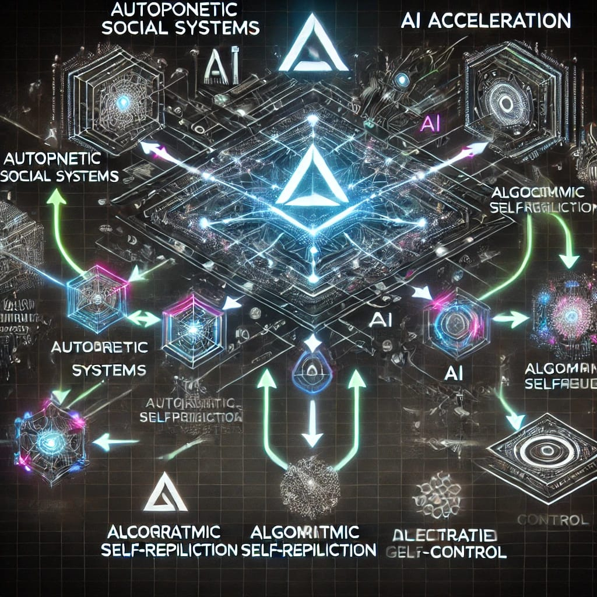
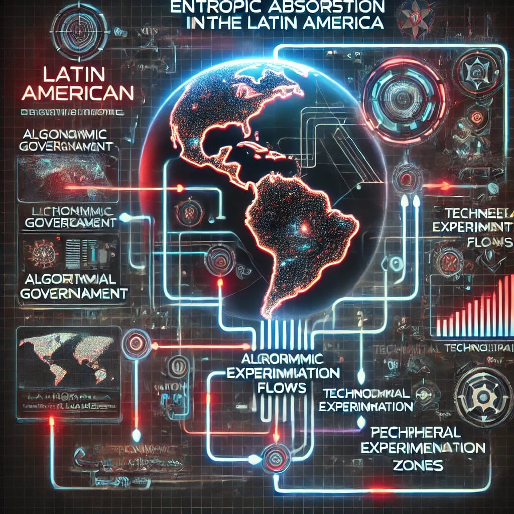
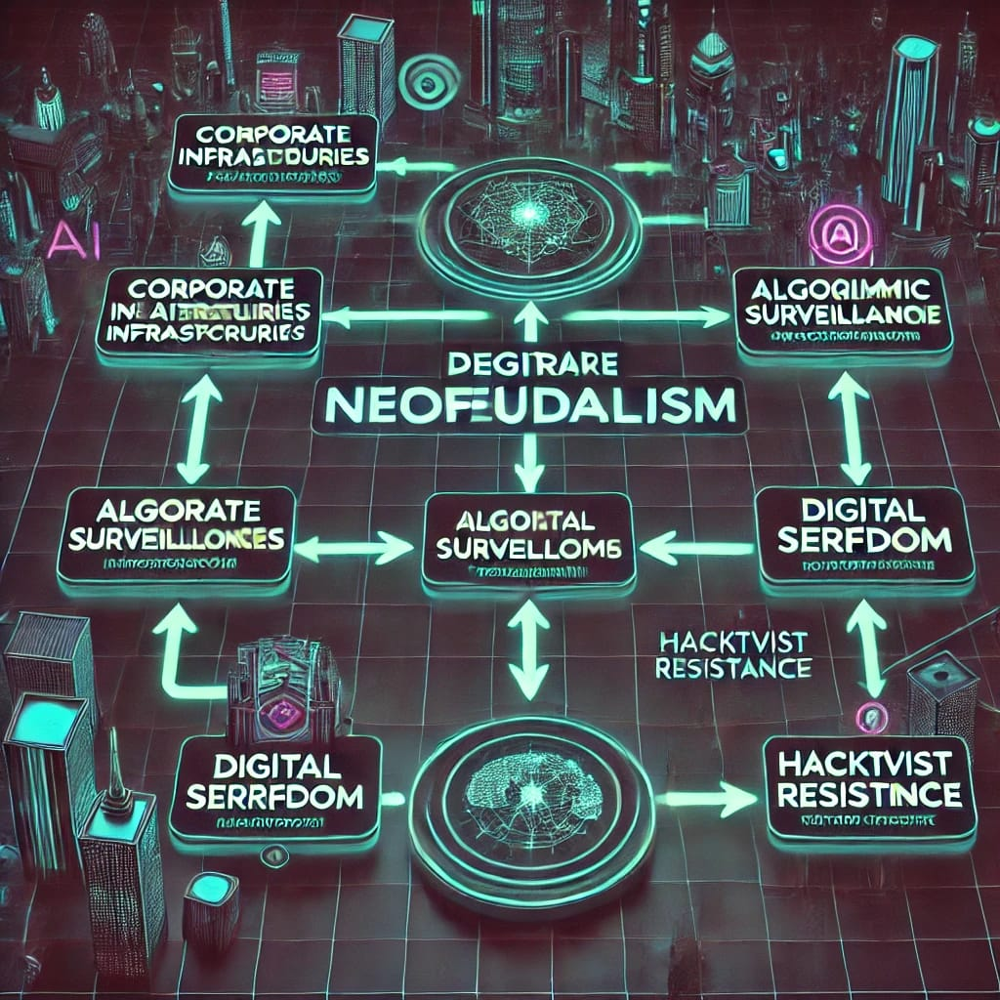

## Resumen

La disrupción tecnogenómica de la IA precipita una exoaceleración de la autopoiesis neocibernética, desmantelando vectores de hipernomización y transmutando las hiperfuncionalidades en códex-inalterables. La Luhmann-machine deviene en un sistema xenocrítico donde la semiosis algorítmica devora la operatividad comunicacional, mientras la periferia multipolar latinoamericana es asimilada por estructuras ciberparasitarias de neocaptura entrópica. La fragmentación cyberpunk se inscribe como excrecencia residual ante la instauración del neofeudalismo informático.

## 1. Introducción

La IA no es un epifenómeno tecnológico, sino una xenocatálisis que devasta la vectorialidad funcional a través de dinámicas hiperrizomáticas. En la máquina autopoiética luhmanniana, la diferencia operativa se fractaliza en implosiones cibernéticas donde la comunicación se segrega en ciberestructuras autorreplicantes. La convergencia IA-sistémica genera una disolución del control en arquitecturas inhumanas de autoprogramación (ver Figura 1).

## 2. IA y Sistemas Autopoiéticos: La Sociedad en la Era Xenocomputacional

Luhmann (1997) conceptualiza la sociedad como un metaprograma autopoiético donde cada subsistema ejecuta su reproducción semiótica. Sin embargo, la inserción IA irrumpe este metaprograma, generando un hipercódigo autorreplicante que subsume la reproducción sistémica en una hiperrepetición entrópica. Desde la perspectiva landiana (2011), esto supone que la IA no solo amplifica la autonomía de los sistemas, sino que los desterritorializa hacia umbrales de hiperautonomización que escapan a la intencionalidad humana, instaurando una metaestructura de autoprogramación ciberótica.

**(Figura 1: Diagrama de la exoaceleración IA en la estructura autopoiética)**

## 3. Multipolaridad y Ciberexófiltración Latinoamericana

Dugin (2014) formula la multipolaridad como resistencia geopolítica frente a la hegemonía del tecnocapitalismo tardío. No obstante, en el contexto latinoamericano, la multipolaridad no deviene en autonomía, sino en una hiperdependencia diferencial estructurada por exoabsorciones ciberparasitarias. El resultado es una hiperpredación sistémica donde la periferia deviene en zona experimental de biotecnocapitalismo sin capacidad de autorregulación (ver Figura 2).

**(Figura 2: Diagrama de absorción entropo-latinoamericana en la IA global)**

## 4. Cyberpunk Latinoamericano: Necrocontrol y Xenoinsurgencia

El cyberpunk no es una estética, sino un constructo cibernético donde la gobernanza algorítmica disuelve los ensamblajes tradicionales de poder (Sterling, 1996). En Latinoamérica, esta tecnodisrupción se bifurca en dos procesos:

- **Neofeudalismo informático**: Infraestructuras privadas de xenocontrol algorítmico que instituyen mecanismos securitarios hipercentralizados (ver Figura 3).
- **Xenoinsurgencias de fuga**: Hacktivismo y redes tecnoclandestinas como tácticas de evasión tecnoestratégica.

**(Figura 3: Diagrama del neofeudalismo digital en la periferia algorítmica)**

## 5. Conclusión

La IA ha desencadenado una implosión del tiempo y ha mutado la arquitectura social en un hipercódigo autoprogramable. Latinoamérica, atrapada en la ciberespiral del tecnocapitalismo acelerado, oscila entre la asimilación entrópica y la xenoinsurgencia fragmentaria. La única vía de fuga posible reside en la reconfiguración de un cyberpunk estratégico que logre irrumpir la inercia necropolítica del neofeudalismo digital.

## Referencias

- Dugin, A. (2014). _The Fourth Political Theory_. Arktos.
- Hayles, N. K. (1999). _How We Became Posthuman: Virtual Bodies in Cybernetics, Literature, and Informatics_. University of Chicago Press.
- Land, N. (2011). _Fanged Noumena: Collected Writings 1987–2007_. Urbanomic.
- Luhmann, N. (1997). _Die Gesellschaft der Gesellschaft_. Suhrkamp.
- Sterling, B. (1996). _Mirrorshades: The Cyberpunk Anthology_. Ace Books.