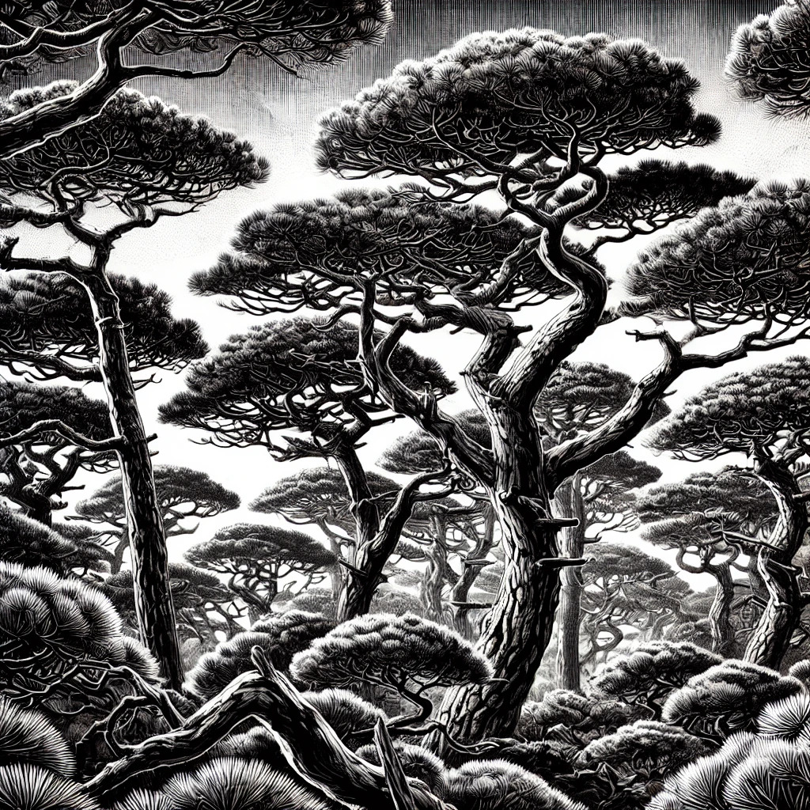
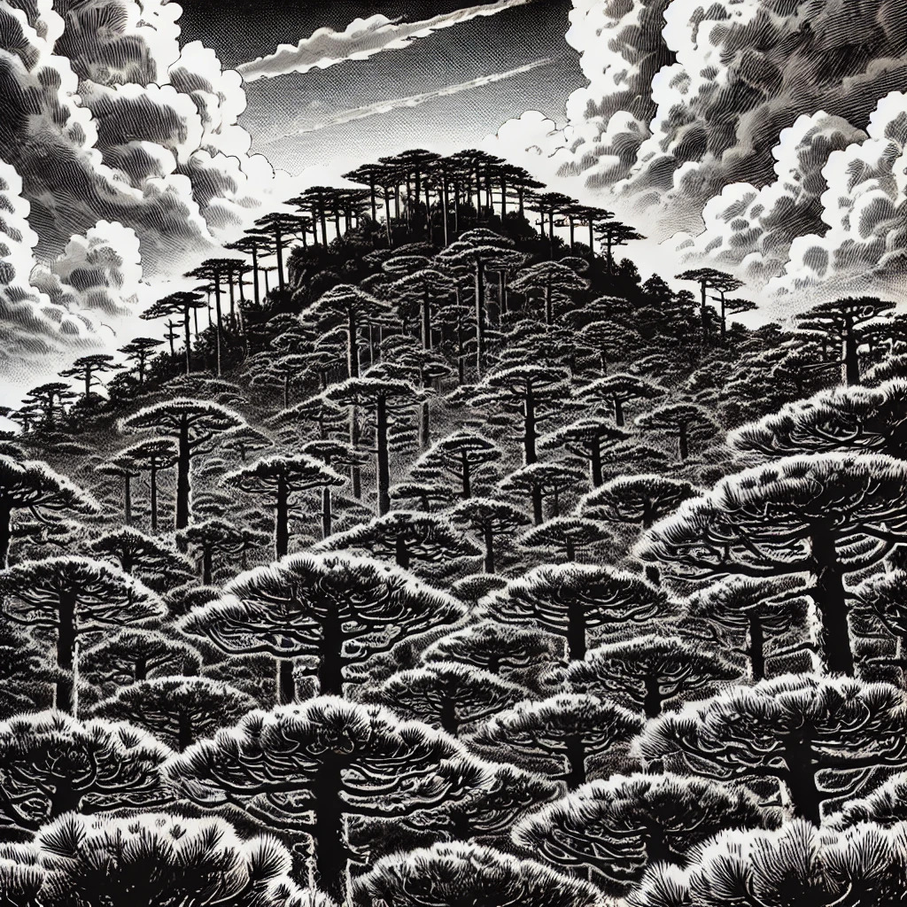
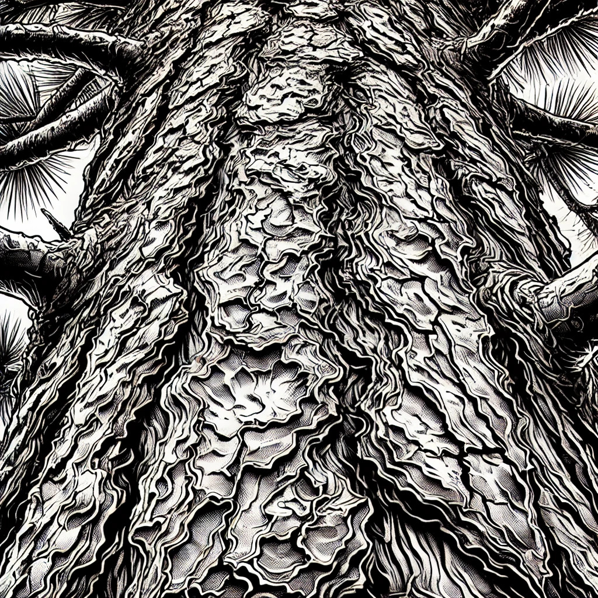
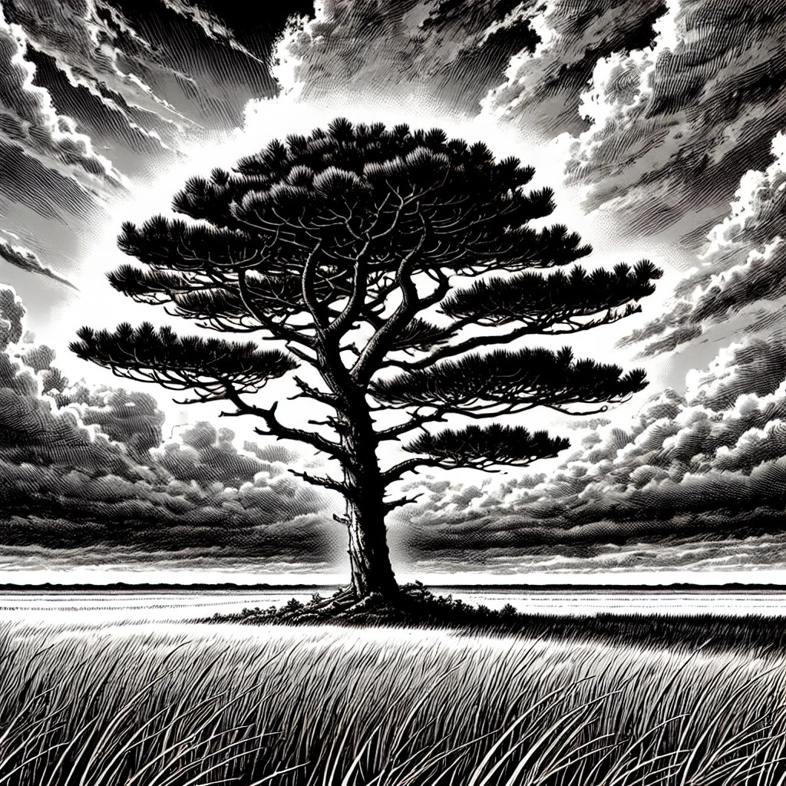
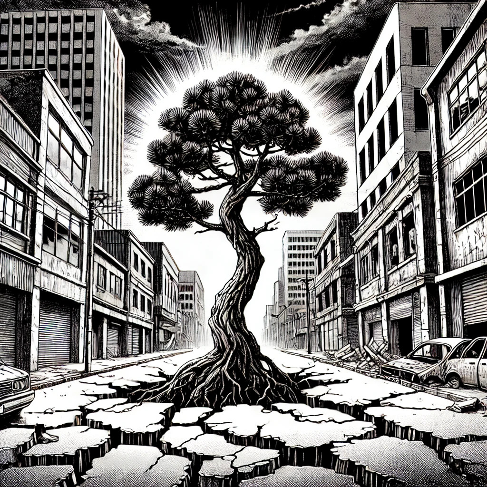
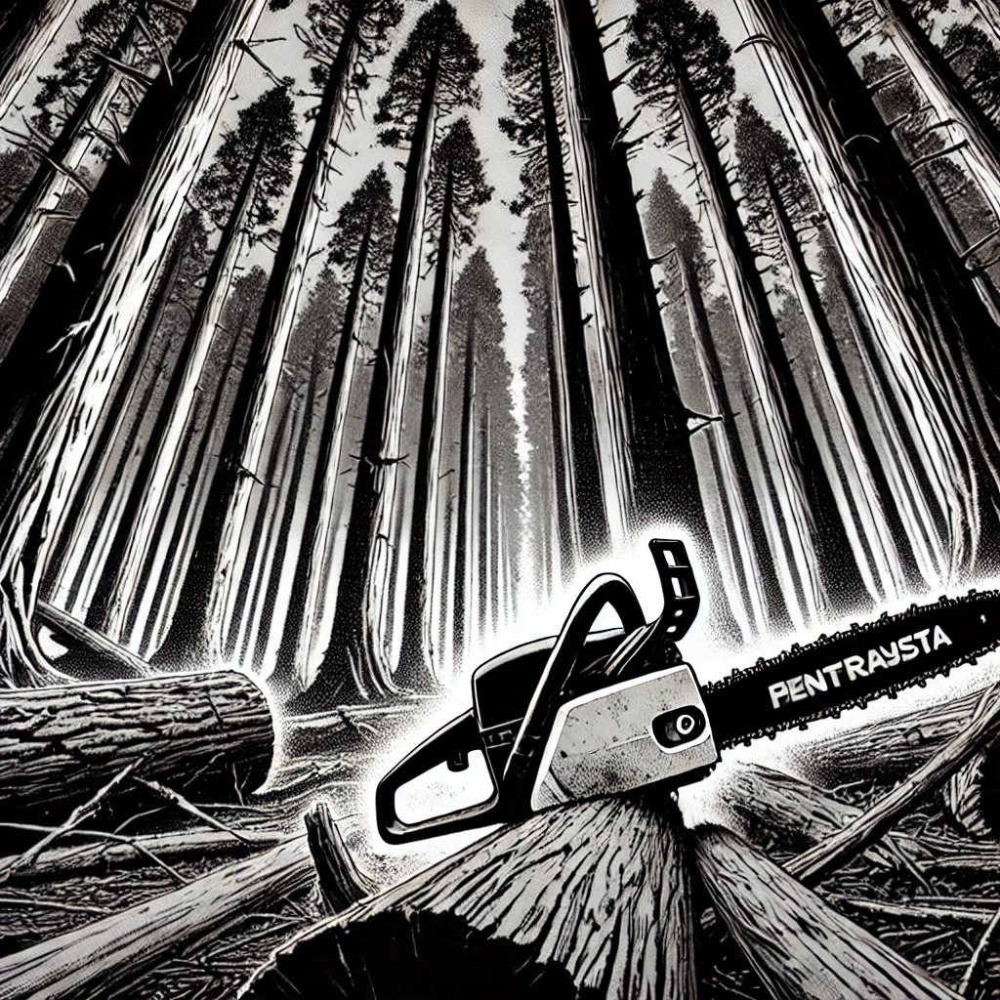

**LOS APUNTES PERDIDOS DE JUAN FRANCO DE LA JARA: EL BOSQUE COMO CONSPIRACIÓN**  

*"Un bosque no es un bosque. Un bosque es una escritura. Un bosque es un código. No hay selva, hay ecuaciones de dominación y ciclos de combustión escritos en la lignina"*.

En los sótanos de la Escuela de Ingeniería Forestal de la Universidad de Talca, entre expedientes olvidados y estudios cartográficos ya caducos, apareció un manuscrito inconcluso. Anotaciones dispersas, grafía desordenada, fragmentos de una teoría que nunca fue publicada. Juan Franco de la Jara, académico excéntrico y marginado, bosquejó en sus últimos años una hipótesis radical: el monocultivo de pinos no era solo una estrategia económica, sino una conspiración material, una guerra latente entre el reino vegetal, el Estado y las comunidades mapuches.

*"El pino radiata: un cuerpo ajeno. No es un árbol, es un enclave. No es silvicultura, es infraestructura de ocupación"*.

Desde su llegada a Chile en el siglo XIX, el pino radiata ha sido la especie vegetal más eficiente en la conversión del territorio en mercancía. Crece rápido, sin resistencia, con la voracidad de una entidad extrahumana que no pertenece ni al suelo ni al clima. Pero su eficiencia no es biológica: es geopolítica. Su expansión no responde a la naturaleza, sino a una lógica de terraformación. Su objetivo no es solo desplazar la flora nativa, sino preparar la tierra para que no pueda ser otra cosa que pino. Un algoritmo vegetal, un dispositivo de desposesión programado en ciclos de crecimiento y cosecha.

*"La foresta no es naturaleza, es un régimen termodinámico. Toda plantación es una máquina de combustión futura. La guerra comienza cuando la madera se seca"*.

La disputa por la tierra en la Araucanía no es solo un conflicto territorial. Es un problema de entropía. El Estado no protege la soberanía chilena, protege la inflamabilidad controlada del monocultivo. Los incendios no son accidentes, sino momentos de recalibración de la temperatura territorial. La resistencia mapuche ataca las plantaciones no solo porque representan el poder económico de las forestales, sino porque entiende que el pino es una infraestructura colonial. Prenderle fuego es sabotear el código de ocupación.

*"Pinos como operadores sin rostro. No son árboles, son nodos en un sistema extractivo. Crecen como redes, responden como enjambres, son pura conectividad"*.

El Estado combate la insurgencia mapuche con drones, con inteligencia artificial, con leyes antiterroristas. Pero su verdadera fuerza no está en los tribunales ni en las fuerzas especiales, sino en los bosques plantados. Los pinos forman un entramado más resistente que cualquier batallón. Son líneas de ocupación, muros de celulosa que separan la vida comunitaria de la tierra fértil. No necesitan vigilancia, no necesitan ejércitos. Su presencia es suficiente para asfixiar cualquier otra forma de existencia en el territorio.

*"Los incendios se apagan, pero el monocultivo persiste. No es una guerra de fuego, es una guerra de raíces. El problema no es la quema de pinos, el problema es que el suelo ya ha sido escrito en su idioma"*.

El conflicto en la Araucanía no se resuelve con negociaciones ni con represión, porque no es un conflicto político convencional. Es una guerra material, una guerra infraestructural. Se combate en el subsuelo, en los ciclos de agua, en la química del follaje. El enemigo no es el Estado chileno ni las forestales. El enemigo es el régimen del pino, el vector de su expansión, la lógica de su inevitabilidad. Solo arrancándolo desde la raíz se podría pensar en otra posibilidad de habitar el territorio.

*"El monocultivo no tiene bordes. No es solo un fenómeno territorial, es un modelo mental. Su lógica impregna el derecho, la economía, la política. Su crecimiento es la expresión vegetal del capital"*.

El pino radiata no es solo una especie exótica, es un modelo de pensamiento. Es la idea de que la tierra debe ser simplificada, homogeneizada, reducida a un solo propósito. La forestación industrial no es distinta de la administración estatal: ambas buscan eficiencia, crecimiento, estandarización. ¿Cómo se combate un enemigo que no solo está en el suelo, sino en las formas de gobernar?

*"Todo monocultivo es un futuro sin memoria. No hay sombra en los bosques de pinos, solo una luz muerta que no deja espacio para el pasado"*.

En la cosmovisión mapuche, el territorio es memoria. El bosque nativo es un archivo vivo, un tejido de relaciones entre humanos y no humanos. El pino, en cambio, es un bosque sin ancestros, una superficie lisa, una repetición sin historia. Suplantar el bosque nativo por monocultivos es una manera de erradicar no solo ecosistemas, sino también genealogías, relatos, formas de estar en el mundo.

Los apuntes terminan abruptamente. No hay conclusión, solo un esquema inacabado, una lista de coordenadas, referencias a estudios nunca publicados. Un margen con una última anotación: *"La última batalla será contra los suelos. La memoria no está en los libros, está en las capas sedimentarias de la historia"*.